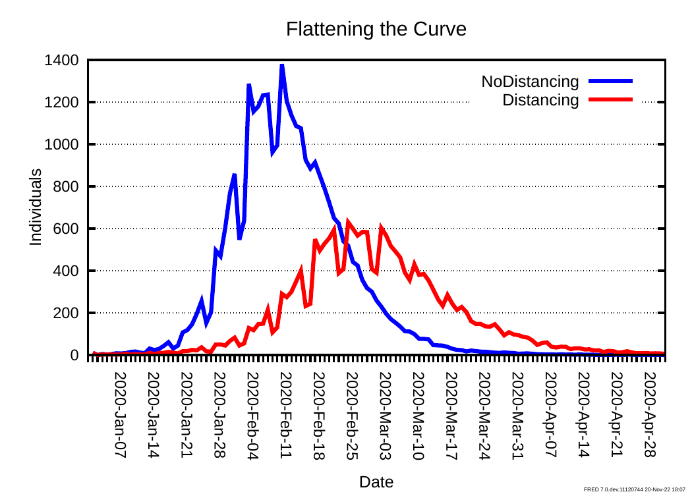
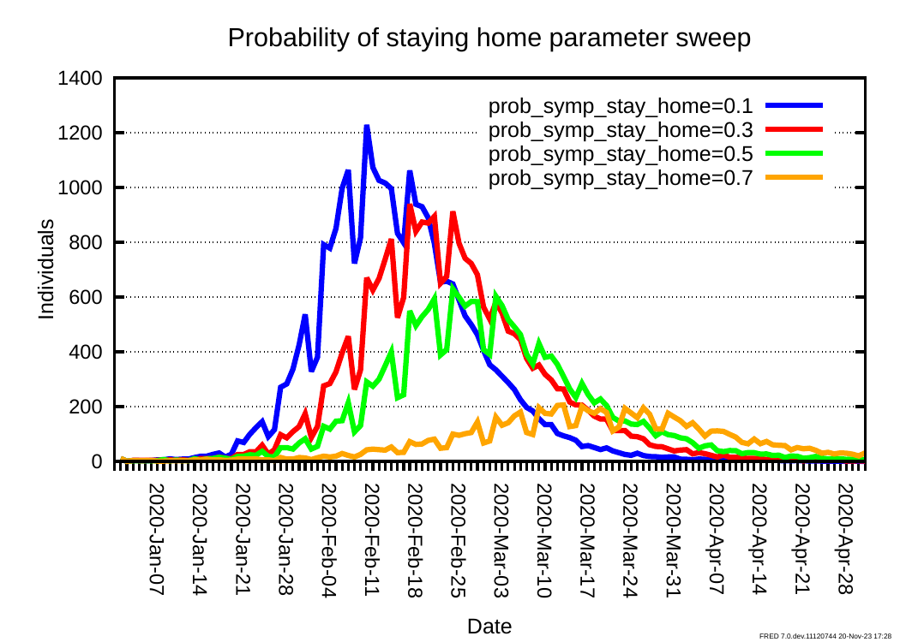
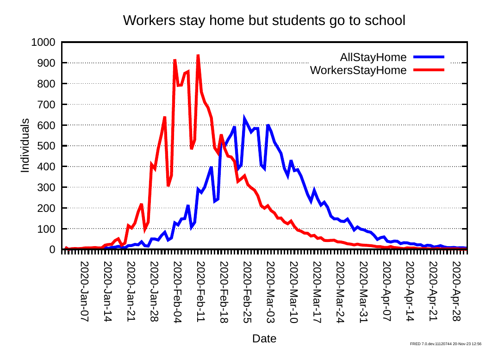
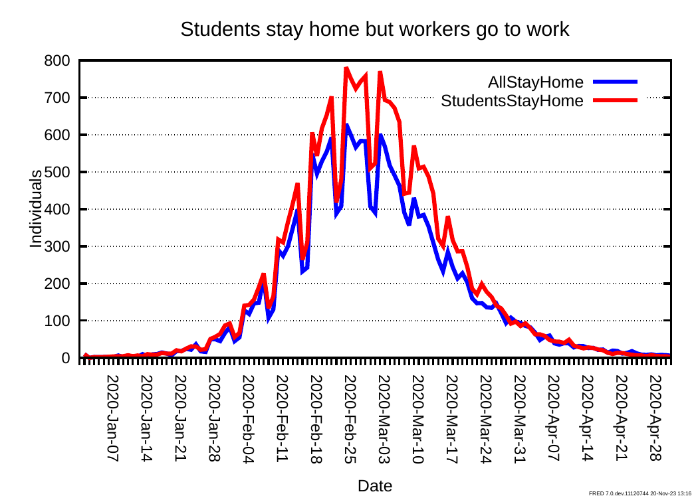

# Flu with Behavior model

## Introduction

This model builds on the Simple Flu model (see `../simpleflu`) by equipping agents with rudimentary social distancing behavior. In the Simple Flu model, agents with the flu continue to behave in the same way as agents without the flu, and will continue to visit all the places they usually visit including work and school. In the Flu with Behavior model, agents who become infected with the flu and are symptomatic have a 50% chance of deciding to stay at home for the duration of time it takes them to recover.

## Review of code implementing the model

The code that implements the Flu with Behavior model is contained in three `.fred` files:

- `main.fred`
- `simpleflu.fred`
- `stayhome.fred`

Here we review the code in these files, focusing on how features of the FRED language are used to implement the Flu with Behavior model described above.

### `main.fred`

Like most FRED models, the entry point to the Flu with Behavior model is a file called `main.fred`. This file specifies the basic simulation control parameters and coordinates how relevant sub-models are loaded. The `simulation` code block from `main.fred` is given below

```fred
simulation {
    locations = Jefferson_County_PA
    start_date = 2020-Jan-01
    end_date = 2020-May-01
    weekly_data = 1
}
```

This is the same as the `simulation` code block from the Simple Flu model. It specifies that the model will be used to simulate the behavior of the synthetic population for Jefferson County, PA for the period January 1 2020 to May 1 2020. By default FRED produces simulation outputs quantifying the evolution of the number of agents in each state on a daily basis in the directory `$FRED_HOME/RESULTS/JOB/<job_num>/OUT/<run_num>/DAILY`. Here `job_num` and `run_num` are, respectively, the job and run numbers for the simulations and are determined at runtime. If `weekly_data = 1` is specified, additional datasets are generated in `$FRED_HOME/RESULTS/JOB/<job_num>/OUT/<run_num>/WEEKLY` that correspond to the daily datasets, but aggregated to the [CDC epidemiological ('epi') week](https://wwwn.cdc.gov/nndss/document/MMWR_Week_overview.pdf) level.

The remaining lines in `main.fred` demonstrate the use of [`include` statements](https://docs.epistemix.com/projects/lang-guide/en/latest/chapter14.html#include-files-and-fred-path) to import sub-models.

```fred
include simpleflu.fred
include stayhome.fred
```

The use of separate files to contain sub-models helps to keep code organized, improves readability and promotes code reuse. Importantly the order that the sub-model files are specified here determines the order in which they will be processed by the compiler. This is important because FRED defines rules for how property definition statements are [overridden by subsequent statements](https://docs.epistemix.com/projects/lang-guide/en/latest/chapter2.html#the-structure-of-a-fred-program), and how additional State execution rules can be specified later in the program to modify behavior.

### `simpleflu.fred`

`simpleflu.fred` is identical to the file of the same name in the Simple Flu model. It specifies the state update rules for the `INFLUENZA` Condition that models agents' status with respect to influenza infection. Specifically, each agent is in one of the following five states:

1. Susceptible to infection with influenza
2. Exposed to influenza
3. Infectious and symptomatic with influenza
4. Infectious and asymptomatic with influenza
5. Recovered following infection with influenza and assumed to be immune

Refer to the tutorial on the Simple Flu model for a complete explanation of the code in `simpleflu.fred`. For the purpose of this tutorial, consider the following code snippet which specifies the State rules for the `InfectiousSymptomatic` and `Recovered` States belonging to the `INFLUENZA` condition:

```fred
    state InfectiousSymptomatic {
        INFLUENZA.trans = 1
        wait(24* lognormal(5.0,1.5))
        next(Recovered)
    }

    ...

    state Recovered {
        INFLUENZA.trans = 0
        wait()
        next()
    }
```

Here `INFLUENZA.trans = 1` and `INFLUENZA.trans = 0` are action rules
that cause agents entering the `INFLUENZA.InfectiousSymptomatic` state
to change their
[transmissibility](https://docs.epistemix.com/projects/lang-guide/en/latest/chapter13.html#the-transmissibility-of-an-agent)
of influenza to 1, and agents entering the `INFLUENZA.Recovered` state
to change their transmissibility of influenza to 0 (i.e. they are
non-infectious). The wait rule `wait(24* lognormal(5.0,1.5))` causes
each agent that becomes infectious and symptomatic to remain so for a
number of days determined by sampling from a [lognormal
distribution](https://docs.epistemix.com/projects/lang-guide/en/latest/chapter7.html#statistical-distribution-functions)
with median=5.0 and dispersion=1.5. Finally the transition rule
`next(Recovered)` causes agents to transition, deterministically, to
the `Recovered` state once their period of infection has elapsed. The
wait rule `wait()` and transition rule `next()` cause agents that
enter the `Recovered` state to remain in that state indefinitely.

### `stayhome.fred`

This file contains the code that implements the social distancing sub-model that is particular to the Flu with Behavior model. We first specify a new Condition, `STAY_HOME`

```fred
condition STAY_HOME {
    start_state = No

    state No {}

    state Yes {
        absent()
        present(Household)
        wait()
        next()
    }
}
```

The empty braces following the declaration of the `No` state causes it to be assigned the [**default configuration**](https://docs.epistemix.com/projects/lang-guide/en/latest/chapter10.html)--agents entering this state perform no actions and remain in this state indefinitely unless influenced by an external factor (including an action rule of a state belonging to a different Condition). It is significant that the `start_state` assigns `No` as the default state for the condition. The configuration of the `Yes` state demonstrates a feature of the FRED language which has not been discussed previously: the [`absent` and `present` actions](https://docs.epistemix.com/projects/lang-guide/en/latest/chapter10.html#actions-on-an-agents-groups). If an agent is **absent** from a group or location, they do not attend that group or location even if they otherwise would. The statement `absent()` causes an agent to avoid _all_ groups or locations. Conversely `present(Household)` causes agents who were previously absent from their household to resume attending their household. The combination of the `absent()` and `present(Household)` actions in the definition of the `STAY_HOME.Yes` state cause agents entering that state to _exclusively_ attend their household (i.e. stay home). Note that the effects of `absent` and `present` actions on an agent only apply while the agent remains in the state in which the actions were specified, and are reset when an agent leaves that state. This is why agents do not need to explicitly re-join their work when they enter the `STAY_HOME.No` state. Finally the `wait()` wait rule and `next()` transition rule cause agents to remain in the `Yes` state indefinitely.

The remaining code blocks in `stayhome.fred` specify how agents decide to stay at home or not depending on their state with respect to the `INFLUENZA` condition.

```fred
state INFLUENZA.InfectiousSymptomatic {
    if (bernoulli(0.5)==1) then set_state(STAY_HOME,Yes)
}


state INFLUENZA.Recovered {
    set_state(STAY_HOME,No)
}
```

Here `set_state` is an action that [updates an agent's state](https://docs.epistemix.com/projects/lang-guide/en/latest/chapter10.html#actions-on-an-agents-condition). The statement `set_state(STAY_HOME,No)` in the `INFLUENZA.Recovered` code block causes agents entering the `INFLUENZA.Recovered` change their `STAY_HOME` state to `No`--they are healthy again so they return to work and school. The statement `if (bernoulli(0.5)==1) then set_state(STAY_HOME,Yes)` in the `INFLUENZA.InfectiousSymptomatic` code block is an example of a _conditional_ [action rule](https://docs.epistemix.com/projects/lang-guide/en/latest/chapter10.html#action-rules). Any action rule can optionally include a conditional statement that causes the action to be executed (on an agent-by-agent basis) only if the associated predicate (or predicates) is true. In this case, each time an agent enters the `INFLUENZA.InfectiousSymptomatic` state, a Bernoulli trial with 0.5 probability of success is conducted (we might imagine the agent flips a coin). On a success, the agent changes its `STAY_HOME` state to `Yes`.

Because `stayhome.fred` is imported into `main.fred` after `simpleflu.fred`, the compiler appends the statements in the code blocks specified above to the end of the statements in the `INFLUENZA.InfectiousSymptomatic` and `INFLUENZA.Recovered` declarations in `simpleflu.fred`. It then interprets them in an order consistent with FRED's [State order of execution rules](https://docs.epistemix.com/projects/lang-guide/en/latest/chapter10.html#order-of-rule-execution-in-a-state). These stipulate that within a State:

1. all action rules are executed first,
2. then all wait rules are executed, and
3. finally all transition rules are executed.

Consequently the code blocks in the previous code snippet in combination with the relevant statements in `simpleflu.fred` result in the following _effective_ definitions of the `INFLUENZA.InfectiousSymptomatic` and `INFLUENZA.Recovered` states for the simulation overall.

```fred
state InfectiousSymptomatic {
    INFLUENZA.trans = 1  # action rule
    if (bernoulli(0.5)==1) then set_state(STAY_HOME,Yes)  # action rule
    wait(24* lognormal(5.0,1.5))  # wait rule
    next(Recovered)  # transition rule
}


state Recovered {
    INFLUENZA.trans = 0  # action rule
    set_state(STAY_HOME,Yes,No)  # action rule
    wait()  # wait rule
    next()  # transition rule
}
```

This is an example of modifying the state rules of a State that is assumed to have been previously defined in the program.

## Sample model outputs

### Running the model

<<<<<<< Updated upstream
Here we demonstrate how to run the model described above, and explore three use cases showing how the model can be used to help address policy questions. Note that these instructions assume that you have configured your environment
as described in the
[FRED Local Guide ](https://docs.epistemix.com/projects/fred-local), with FRED
running in a Docker container.
=======
Here we demonstrate how to run the model described above, and explore three use cases showing how the model can be used to help address policy questions. Note that these instructions assume that you are running the model with a local FRED installation such as that obtained by following the [installation instructions in the FRED Installation Guide](https://docs.epistemix.com/projects/fred-local/en/latest/). If you are running FRED using another method (from inside a Docker image, for example) you may need to modify these instructions accordingly.
>>>>>>> Stashed changes

To run the Flu with Behavior model, run the FRED Local image and directly
access the shell as describe in the [Direct Shell Access](https://docs.epistemix.com/projects/fred-local/en/latest/chapter2.html#direct-shell-access)
section of the guide. The examples here assume you are running on a Linux or
macOS system. These can be adapted to run on Windows as described in the guide.
open a terminal and navigate to the directory where the Flu with Behavior model is saved, for example:

```bash
$ docker exec -it fred /bin/bash
root@a48b40b88a53:/fred/models# pwd
/fred/models
root@a48b40b88a53:/fred/models# cd FRED-tutorials/flu-with-behavior
root@a48b40b88a53:/fred/models/FRED-tutorials/flu-with-behavior# 
```

The configuration, as described in the FRED Local Guide, ensures that the
FRED environment variables and command-line tools are accessible.

We can now run the model with default settings and generate some visualizations of its outputs using the `./METHODS` script provided with the model files:

```bash
root@a48b40b88a53:/fred/models/FRED-tutorials/flu-with-behavior# ./METHODS
```

This generates the file `flatten.pdf` which contains a plot showing two time series that enable us to compare the number of individuals exposed to influenza under two different modeling **scenarios**: one with `NoDistancing` (the original Simple Flu model), and one with `Distancing` (the Flu with Behavior model).


<p class="caption"><span class="caption-text">Time series of exposed
individuals with and without distancing behavior</span></p>

We see that the social distancing behaviors included in the Flu with Behavior model appear to both delay and reduce the magnitude of the peak number of individuals exposed to the virus during the modeled epidemic.

In the following sections we demonstrate an exploratory model workflow in which we modify details of the model code to investigate:

1. The sensitivity of the model outputs to certain modeling assumptions
2. The effect of alternative policy decisions on the emergent dynamics of the epidemic

### Vary likelihood that symptomatic individuals decide to stay home

A major modeling assumption in the Flu with Behavior model that is that all agents experiencing symptoms of flu decided to stay home with 50% probability. As this assumption is subject to uncertainty, our exploratory analysis of the model should include a sensitivity analysis of the model to this parameter.

To make varying the probability that symptomatic agents decide to stay home easier, we will convert it into a parameter called `prob_symp_stay_home`. To do this we modify the `stayhome.fred` file to declare `prob_symp_stay_home` as a variable with default value 0.5, and change the definition of the `INFLUENZA.InfectiousSymptomatic` state to use the new variable rather than the original hard coded value

```fred
variables {
    global prob_symp_stay_home
    prob_symp_stay_home = 0.5
}
...
state INFLUENZA.InfectiousSymptomatic {
    if (bernoulli(prob_symp_stay_home)==1) then set_state(STAY_HOME,Yes)
}
```

Now modify `main.fred` so that it loads a file called `parameters.fred` in addition to the model files `simpleflu.fred` and `stayhome.fred`

```fred
...
include simpleflu.fred
include stayhome.fred
include parameters.fred
```

We can now create a script that performs a [parameter sweep](https://docs.epistemix.com/projects/fred-sims/en/latest/sim-guide/chapter3.html), in which the model is run multiple times with each run using a different value for `prob_symp_stay_home`. This script could be written in any scripting language of the user's choice. Below we provide an example of such a script written in bash. This runs the model with the probability of agents with symptoms staying home set to 10%, 30%, 50%, and 70%. The script then plots a time series of the number of exposed individuals for each of these parameter values.

Note that this script can be created outside of the FRED Local Docker
environment, and will still be available within the mounted `models` directory
in the container.

```bash
#! /usr/bin/env bash

PROBS_STAY_HOME=("0.1" "0.3" "0.5" "0.7")

for P in ${PROBS_STAY_HOME[@]}
do
    # Generate parameters.fred file
    printf "parameters {\nprob_symp_stay_home = ${P}\n}\n" > parameters.fred

    # Determine the job name for the run with this parameter
    KEY="stay-home-prob=${P}"
    # Add job name to an accumulating list of job names
    KEY_LIST="${KEY_LIST}${KEY},"
    # Add parameter to an accumulating list of parameters
    PARAM_LIST="${PARAM_LIST}prob_symp_stay_home=${P},"
    PLOT_VARS="${PLOT_VARS}INFLUENZA.newExposed,"

    # Clear any existing results with the current key
    fred_delete -f -k $KEY

    # Run 4 simulations (two in parallel) for the current parameter
    fred_job -k $KEY -p main.fred -n 4 -m 2
done

# Plot the results
fred_plot -o prob-stay-home -k $KEY_LIST \
    -v $PLOT_VARS \  # INFLUENZA.newExposed for every parameter
    -t "Probability of staying home parameter sweep" \
    -l $PARAM_LIST
```

Execute this script `prob-stay-home-sweep.sh` within the Docker environment.
This should produce a file called `prob-stay-home.pdf`. Due to the stochastic
nature of the simulation, your results should look similar but not exactly
the same as the following chart.


<p class="caption"><span class="caption-text">Time series of exposed
individuals with different probabilities symptomatic individuals decide to stay 
home</span></p>

As we might have expected, increasing the probability that individuals who become symptomatic decide to stay home decreases the number of individuals who are exposed to flu.

### Individuals continue to attend School when sick

In this scenario we investigate the effect of causing agents who experience symptoms of flu to continue to attend school. This might represent the effect of a policy decision to discourage students from social distancing out of concern for the impact it would have on their education.

Reset the probability that symptomatic agents decide to stay home to 50% in `stayhome.fred`:

```fred
state INFLUENZA.InfectiousSymptomatic {
    if (bernoulli(0.5)==1) then set_state(STAY_HOME,Yes)
}
```

Create a copy of `stayhome.fred` called `workers-stayhome.fred`

```bash
$ cp stayhome.fred workers-stayhome.fred
```

Modify the actions in the `STAY_HOME.Yes` state  in `workers-stayhome.fred` so that agents are present at `School` as well as their `Household`

```fred
condition STAY_HOME {

    state No {}

    state Yes {
        absent()
        present(Household)
        present(School)
        wait()
        next()
    }
}
```

Create a new `main.fred` that includes `workers-stayhome.fred` rather than the original `stayhome.fred`

```bash
$ cp main.fred main-workers-stayhome.fred
```

Modify `main-workers-stayhome.fred` so it includes `workers-stayhome.fred` instead of `stayhome.fred`

```fred
...
include simpleflu.fred
include workers-stayhome.fred
```

Write a bash script to run the simulations and plot the results, call this `workers-stayhome.sh`

```bash
#! /usr/bin/env bash

fred_delete -f -k flu-with-behavior
fred_delete -f -k workers-stayhome

fred_job -k flu-with-behavior -p main.fred -n 4 -m 2
fred_job -k workers-stayhome -p main-workers-stayhome.fred -n 4 -m 2

fred_plot -o workers-stayhome -k flu-with-behavior,workers-stayhome, \
    -v INFLUENZA.newExposed,INFLUENZA.newExposed \
    -t "Workers stay home but students go to school"  \
    -l AllStayHome,WorkersStayHome, --clean
```

Running this script in Docker produces output similar to the following.


<p class="caption"><span class="caption-text">Time series of exposed
individuals with and without students staying home</span></p>


We see that having only workers stay home and encouraging students to go to school is less effective at reducing the number of people exposed to the flu than if everyone considers staying home when they experience symptoms. Specifically, allowing everyone to stay home if they choose to do so upon becoming symptomatic reduces the number of exposures and delays the peak daily number of exposures compared to if students are forced to attend school.

### Individuals continue to attend Work when sick

Here we consider the case where agents are allowed to stay home from school when they experience symptoms, but agents who go to work are not allowed to stay home. This is effectively the inverse of the previous scenario, and consequently many of the changes to the model files are analogous. This scenario might represent the effect of a policy decision to discourage workers from social distancing out of concern for the impact it would have on the economy.

Create a copy of `stayhome.fred` called `students-stayhome.fred`

```bash
$ cp stayhome.fred students-stayhome.fred
```

Modify the actions in the `STAY_HOME.Yes` state  in `students-stayhome.fred` so that agents are present at `Workplace` as well as their `Household`

```fred
condition STAY_HOME {

    state No {}

    state Yes {
        absent()
        present(Household)
        present(Workplace)
        wait()
        next()
    }
}
```

Create a new `main.fred` that includes `students-stayhome.fred` rather than the original `stayhome.fred`

```bash
cp main.fred main-students-stayhome.fred
```

Modify `main-workers-stayhome.fred` so it includes `students-stayhome.fred` instead of `stayhome.fred`

```fred
...
include simpleflu.fred
include students-stayhome.fred
```

Write a bash script to run the simulations and plot the results, call this `students-stayhome.fred`

```bash
#! /usr/bin/env bash

fred_delete -f -k flu-with-behavior
fred_delete -f -k students-stayhome

fred_job -k flu-with-behavior -p main.fred -n 4 -m 2
fred_job -k students-stayhome -p main-students-stayhome.fred -n 4 -m 2

fred_plot -o students-stayhome -k flu-with-behavior,students-stayhome, \
	  -v INFLUENZA.newExposed,INFLUENZA.newExposed \
	  -t "Students stay home but workers go to work"  \
	  -l AllStayHome,StudentsStayHome, --clean
```

Running this script produces the following output


<p class="caption"><span class="caption-text">Time series of exposed
individuals with and without workers staying home</span></p>

Like the scenario where students were forced to attend school but workers could choose to stay home, when students are allowed to stay home but workers must go to work, the number of agents exposed to the flu is higher than if everyone is allowed to stay home. However, unlike in the previous scenario, allowing workers as well as students stay home doesn't appear to cause a delay in the peak daily number of agents exposed to the flu compared to if only students are allowed to stay home.

## Summary

### Additional language features introduced

In addition to the features of the FRED language used in the Simple Flu model, this model also demonstrates the following features:

- The `absent` and `present` actions are used in `stayhome.fred` to control the Places agents attend, depending on their conditions.
- State rule shadowing is used in `stayhome.fred` to modify the the rules for a state defined previously in the program.
- `stayhome.fred` contains an example of a conditional action rule that is only executed if a predicate is true.
- Use of variables to specify parameters in place of hard-coded data.

### Modeling workflow concepts introduced

- Used a custom bash script to perform a [parameter sweep](https://docs.epistemix.com/projects/fred-sims/en/latest/sim-guide/chapter3.html)
