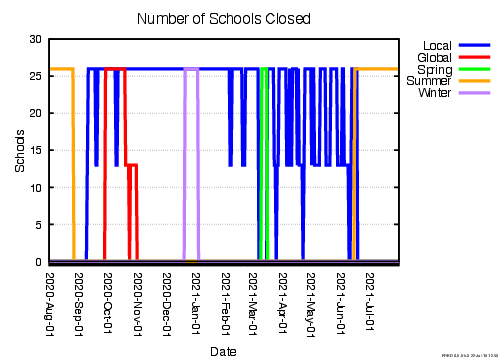
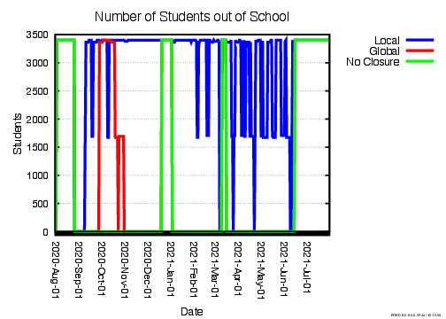
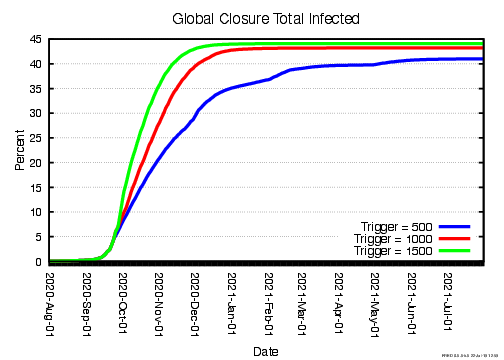
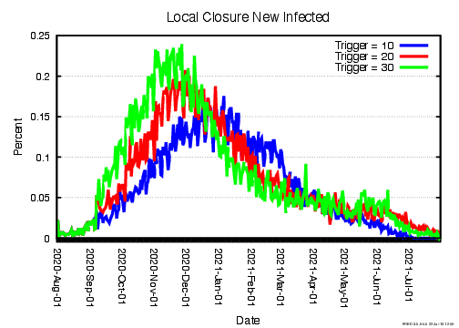
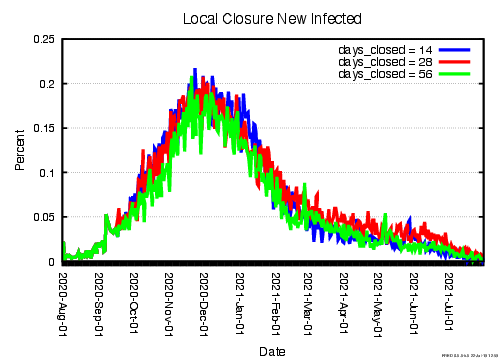

# School Closure Model

## Overview

This model studies the effects of school closures in Jefferson County.  The `main.fred` file includes three components: 

* Influenza condition
* `school.fred`: a condition for admins to close the school according to case numbers in their school or county as well as normally scheduled holiday closure dates.  This condition also keeps track of students whose schools are closed.
* `parameters.fred` : a file written into by the `METHODS` script to modify the school closure policies and other variables.


### Normal Closures

The schools are given a school schedule that closes the schools during summer, winter, and spring break.  There are states for each break: `WinterBreak`, `SpringBreak`, and`SummerBreak`.  In these states, admins close their schools and wait until the end of the break period.  They pass into these states from the `Check_Calendar` state:


```fred
    state Check_Calendar {
        wait(0)
        if (date_range(Dec-20,Jan-02)) then next(WinterBreak) 
        if (date_range(Mar-10,Mar-15)) then next(SpringBreak)
        if (date_range(Jun-15,Aug-25)) then next(SummerBreak)
        default(Open)
    }
```
Admins go to the break states by checking the current date with `date_range()`. The admins only pass into this check state if their school is not already affected by flu closures.
No flu closures will take place if `school_closure_policy` is set equal to `NO_CLOSURE`.


### School Closure due to Flu

The schools are also setup to actively check the number of cases of flu either in their school or in their county and close schools if the number passes a threshold set by one of the variables: `local_closure_trigger` or `global_closure_trigger`.  After deciding to close due to the flu, the admin goes to the `Close` state, and the school remains closed for a time period set by the variable `days_closed`.

#### Global Flu Closure
The `GLOBAL_CLOSURE `, `LOCAL_CLOSURE`, and `NO_CLOSURE` variables are set to arbitrary numeric values to get around the inability to assign strings to variables.  The global closure option is selected by setting `school_closure_policy = GLOBAL_CLOSURE `.  This variable passes admins from the `Check_Epidemic` state in the `SCHOOL` condition to the `Check_Global_Epidemic ` state:


```fred
    state Check_Global_Epidemic {
        wait(0)
		if (global_closure_trigger <= current_count_of_INF.Is) then next(Close)
        default(Check_Calendar)
    }
```

This state checks the county flu count against the global threshold, `local_closure_trigger`.  If the threshold is reached, then all admins go to `Close` state.
#### Local Flu Closure

The local closure option is selected by setting `school_closure_policy = LOCAL_CLOSURE `.  This variable passes admins from the `Check_Epidemic` state in the `SCHOOL` condition to the `Check_Local_Epidemic ` state:


```fred
    state Check_Local_Epidemic {
        wait(0)
		if (local_closure_trigger <= current_count_of_INF.Is_in_School) then next(Close)
        default(Check_Calendar)
    }
```

In this state, each admin checks if the number of infected agents in their own school is greater than the threshold set by `local_closure_trigger `.  If the number is greater or equal, then the admin goes to the `Close` state and closes the school, otherwise they pass to the `check_calendar` state.

#### Student Tracking
The `StudentSchoolOpen` and `StudentSchoolOpen` states are included in the `SCHOOL` condition to keep track of how many students have their school closed/open over the course of time.  Students are filtered into `StudentSchoolOpen` from the `Start` state with the conditional
`if (profile == student)`.  The students then switch between the two states by checking if their school has been closed by an admin using the `has_been_closed(<group>)` mixing predicate.
##Results

###Plotting Flu Cases
The following plots show the effectiveness of the different policies in limiting the number of total and daily infections as a percent of the county population.

|
:-------------------------:|:-------------------------:

###Plotting School Closures

The plots below show the number of schools closed and number of students out of school over time.  Because the threshold for school closure is the same regardless of school size, the larger schools are more likely to close under the local closure policy.  This results in a higher percentage of students out of school than percentage of schools closed for the local policy.

|
:-------------------------:|:-------------------------:

## Modifying Closure Variables
Variables are modified via the `METHODS` script which overwrites various combinations the `school_closure_policy`, `days_closed`, `global_closure_trigger`, and `local_closure_trigger` variables into the `parameters.fred` file to test and plot various scenarios seen below.
 Note that unless stated otherwise, the variables in the simulation represented below are:

* `global_closure_trigger = 1000`
* `local_closure_trigger = 20`
*  `days_closed = 28`.

### Changing the `global_closure_trigger` Variable
| 
:-------------------------:|:-------------------------:


### Changing the `local_closure_trigger` Variable
| 
:-------------------------:|:-------------------------:  


### Changing the `days_closed` Variable Under Global Closure

 |  
:-------------------------:|:-------------------------:


### Changing the `days_closed` Variable Under Local Closure
  |  
:-------------------------:|:-------------------------: