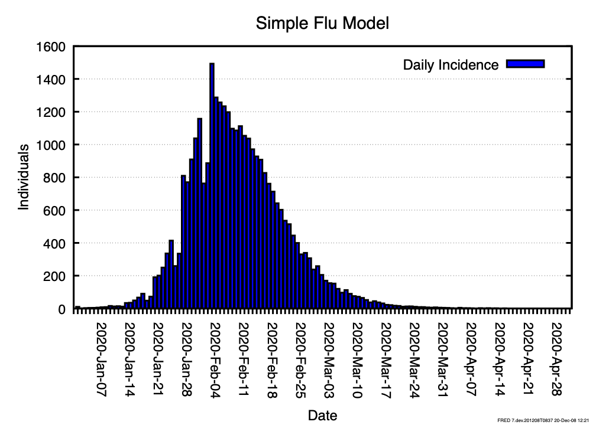

# Simple Flu

## Introduction

This example introduces the **Simple Flu** model, which is a standalone model of flu infection and the basis for the `../flu-with-behavior`, `../school-closure`, and `../vaccine` tutorials.
This model defines a condition, `INFLUENZA`, which agents can contract via either the meta agent (to create initial infections) or other agents.
Having contracted the condition, agents either do or do not develop symptoms and then recover, at which point they can no longer contract `INFLUENZA`.

## Review of code implementing the model

The code that implements the **Simple Flu** model is contained in two `.fred` files:

- `main.fred`
- `simpleflu.fred`

### main.fred

This file does not contribute to the model of flu contagion -- that model is entirely defined in `simpleflu.fred`.
Instead, the `main.fred` file defines the location and time period of a particular run of simulations and imports the FRED model that defines the `INFLUENZA` condition.

The `simulation` block handles the first part of this.
This block is required to define what location and time period will be simulated.
This instance also specifies that weekly outputs will be generated with `weekly_data = 1`.

```fred
simulation {
    locations = Jefferson_County_PA 
    start_date = 2020-Jan-01
    end_date = 2020-May-01
    weekly_data = 1
}
```

The only additional content in this file is the line `include simpleflu.fred`, which imports the `INFLUENZA` condition and associated states from `simpleflu.fred`.

### simpleflu.fred

This file does all of the definition of the `INFLUENZA` condition and its initial conditions.
`INFLUENZA` is a condition that can be passed by coming into contact with other agents (`transmission_mode = proximity`).
Agents all begin in the `Susceptible` state, where they have their susceptibility set to 1 and wait indefinitely to be `exposed`.
Exposure, either via the meta agent or another agent, moves a given agent to `Exposed`.

```fred
state Susceptible {
    INFLUENZA.sus = 1
    wait()
    next()
}
```

Once in `Exposed`, an agent loses its susceptibility to `INFLUENZA`.
The agent then waits through an incubation period and either moves to a symptomatic infection state (`InfectiousSymptomatic`) with a probability of 0.33 or moves to an asymptomatic infectious state (`InfectiousAsymptomatic`) with a probability of 0.67.
Explicitly defining transition probabilities is one way of introducing stochastic behavior into the model.
Another way is to draw values from a probability distribution, demonstrated by defining the incubation period for each agent as a sample from a `lognormal` distribution

```fred
state Exposed {
    INFLUENZA.sus = 0
    wait(24*lognormal(1.9,1.23))
    next(InfectiousAsymptomatic) with prob(0.33)
    default(InfectiousSymptomatic)
}
```

Both infectious states are identical with the exception of their transmissibility.
Once entering one of the infectious states after the wait period in `Exposed`, agents gain a non-zero transmissibility and wait through an infectious period before recovering.
Asymptomatic infections are half as transmissible as infectious ones, according to this model.

```fred
state InfectiousSymptomatic {
    INFLUENZA.trans = 1          # this value is .5 for InfectiousAsymptomatic
    wait(24* lognormal(5.0,1.5))
    next(Recovered)
}
```

Once the infectious period is over, agents move to the `Recovered` condition.
This condition reduces transmissibility of `INFLUENZA` to zero and continues indefinitely.

```fred
state Recovered {
    INFLUENZA.trans = 0
    wait()
    next()
}
```

The only remaining state in `simpleflu.fred` is the `Import` condition, which is the starting state for the meta agent.
This state prompts the meta agent to infect ten agents and then wait indefinitely.

```fred
state Import {
    import_count(10)
    wait()
    next()
}
```

## Sample Model Outputs

This model can be run using the `METHODS` file, which is a `bash` script that runs the models and then uses `fred_plot` to generate a histogram of new infections per day (and week, not shown).
This is consistent with the condition propagating through the specified population and creating enough `Recovered` individuals that the condition can no longer transmit.



## Summary

This tutorial introduces two concepts:

- a `CONDITION` with `States` that can be transmitted between agents.
- a meta agent that introduces the `CONDITION` to the population of agents.

Within the states in `INFLUENZA`, we also used:

- `wait`, which causes the agent to pause in a given state
- `next`, which causes an agent to transition to a new state
- two forms of probabilistic behavior, using `lognormal` to generate wait times and the combination of `next with prob` and `default` to probabilistically assign an agent to symptomatic or asymptomatic infectiousness.
