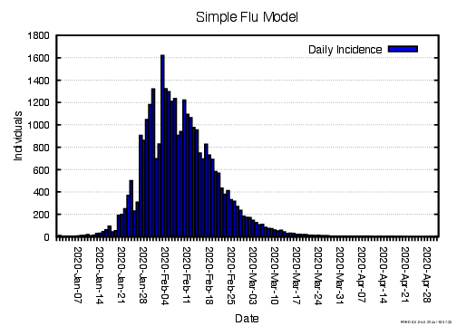

# Simple Flu

This example introduces the **Simple Flu** model, a standalone model for influenza and the basis for the `../flu-with-behavior`, `../school-closure`, and `../vaccine` tutorials.


## Introduction

This model defines a condition, `INFLUENZA`, which agents can contract either via the meta agent (a source of initial infections) or interaction with other agents. Having contracted the condition, agents may develop symptoms or remain astmptomatic before recovering, at which point they are immune and can no longer contract `INFLUENZA`.


## Review of code implementing the model

The code that implements the **Simple Flu** model is contained in two **`.fred`** files:

- **`main.fred`**
- **`simpleflu.fred`**

### main.fred

The **`main.fred`** file organizes the model and specifies the location and time period to be simulated. The `simulation` block handles the latter part of this. Such a block is required in all FRED programs to define the simulated location and time period. In this instance, we also specify that weekly outputs will be generated with the statement `weekly_data = 1`.

```fred
simulation {
    locations = Jefferson_County_PA 
    start_date = 2020-Jan-01
    end_date = 2020-May-01
    weekly_data = 1
}
```

The only additional content in this file is the line `include simpleflu.fred`, which inserts the contents of **`simpleflu.fred`**.  This has the effect of adding the `INFLUENZA` condition to our model.  Multiple `include` statements can added when building a complex model.

### simpleflu.fred

This file defines the `INFLUENZA` condition. `INFLUENZA` is a condition that can be passed by coming into contact with other agents.  This type of transmission is sepcified by the statement `transmission_mode = proximity`. Agents all begin in the `Susceptible` state (`start_state = Susceptible`), where their susceptibility to the condition is set to 1.  Agents wait in this state indefinitely. Exposure, either via the meta agent or another transmissible agent, moves an agent to the `Exposed` state (`exposed_state = Exposed`).  It is not required that the state agents move to after exposure be called "Exposed" as it is in this case.

```fred
condition INFLUENZA {
    transmission_mode = proximity
    transmissibility = 1.0
    start_state = Susceptible
    exposed_state = Exposed
    meta_start_state = Import

    state Susceptible {
        INFLUENZA.sus = 1
        wait()
        next()
    }
```

Once in the `Exposed` state, an agent loses susceptibility to `INFLUENZA`. The agent then waits through an incubation period and either moves to a symptomatic and infectious state, `InfectiousSymptomatic`, with a probability of 0.33 or to an asymptomatic and infectious state, `InfectiousAsymptomatic`, with a probability of 0.67. Explicitly defining transition probabilities is one way of introducing stochastic behavior into the model. Another way is to draw values from a probability distribution, demonstrated by setting the incubation period for each agent as a sample from a `lognormal()` distribution

```fred
    state Exposed {
        INFLUENZA.sus = 0
        wait(24 * lognormal(1.9,1.23))
        next(InfectiousAsymptomatic) with prob(0.33)
        default(InfectiousSymptomatic)
    }
```

Both infectious states are identical with the exception of the effect on transmissibility.
Once entering one of the infectious states after the wait period in `Exposed`, agents gain a non-zero transmissibility and wait through an infectious period before recovering. In this model, asymptomatic infections are set to be half as transmissible as infectious ones. In one of these states agents may transmit the condition to another susceptible agent. 

```fred
    state InfectiousSymptomatic {
        INFLUENZA.trans = 1          # this value is .5 for InfectiousAsymptomatic
        wait(24* lognormal(5.0,1.5))
        next(Recovered)
    }
```

Once the infectious period is over, agents move to the `Recovered` state.
This state reduces transmissibility of `INFLUENZA` for an agent to zero indefinitely.

```fred
    state Recovered {
        INFLUENZA.trans = 0
        wait()
        next()
    }
```

The only remaining state in `INFLUENZA` is the `Import` state, which is the starting state for the meta agent.  This is specified by the `meta_start_state = Import` statement at the top of the condition. This state prompts the meta agent to infect ten random agents at the beginning of the simulation before waiting indefinitely.

```fred
    state Import {
        import_count(10)
        wait()
        next()
    }
```


## Sample Model Outputs

This model can be run using the **`METHODS`** file, which is a `bash` script that runs the model and uses `fred_plot` to generate a histogram of the number of new infections per day (and week, not shown).

```bash
$ ./METHODS

fred_job: starting job simpleflu at <date>

fred_compile -p main.fred
No errors found.
No warnings.

fred_job: running job simpleflu id 833 run 1 ...
fred_job: running job simpleflu id 833 run 2 ...
run_set 0 completed at <date>

fred_job: running job simpleflu id 833 run 3 ...
fred_job: running job simpleflu id 833 run 4 ...
run_set 1 completed at <date>

fred_job: finished job simpleflu <job key> at <date>

fred_plot: image_file = daily.pdf
fred_plot: image_file = weekly.pdf
```

The results are consistent with the INFLUENZA condition propagating through the specified population, resulting in agents moving to the `Recovered` state. Eventually, a large fraction of the population is immune and the condition can no longer transmit.




## Summary

This tutorial introduces two concepts:

- a **condition** with **states** that can be transmitted between agents.
- a **meta agent** that introduces the condition to the population.

Within the states in `INFLUENZA`, we also used:

- `wait()`, which causes the agent to pause in a given state
- `next()`, which causes an agent to transition to a new state
- two forms of probabilistic behavior, using `lognormal()` to generate wait times and the combination of `next() with prob()` and `default()` to probabilistically transition an agent to symptomatic or asymptomatic infectious states.
